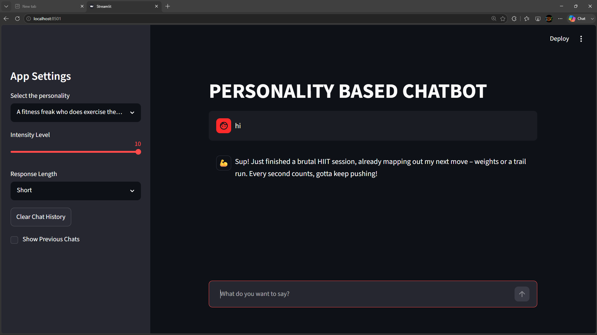

# Personality Based Chatbot

A Streamlit-based AI chatbot that generates responses according to the personality selected by the user. The chatbot uses Google's Gemini 2.5 Flash model and prompt engineering to keep responses consistent with the chosen personality.

## Features

* Multiple built-in personalities
  * 😎 Pro CSE Student
  * 🤔 Therapist
  * 😡 Angry Truth Teller
  * 😱 Panicked Student Before an Exam
  * 😭 Hopeless Man
  * 💪 Fitness Freak

* Personality-aware responses
* Separate conversation history for each personality
* Intensity level control (1–10)
* Response length control (Short, Medium, Detailed)
* Dynamic personality avatars
* Persistent chat history during the session
* Sidebar for viewing previous chats from all personalities
* Clear all chat history option
* Context-aware responses using conversation memory
* Fast responses powered by Gemini 2.5 Flash
* Simple and responsive Streamlit UI

## Tech Stack

* Python
* Streamlit
* Google Gemini 2.5 Flash API
* python-dotenv

## Environment Variable Required

* Create a `.env` file in the project root:
```env
GEMINI_API_KEY=your_api_key_here
```
You can obtain an API key from Google AI Studio.

## Running the Application

```bash
streamlit run main.py
```

### Result
Assignment - 2

Assignment - 3
